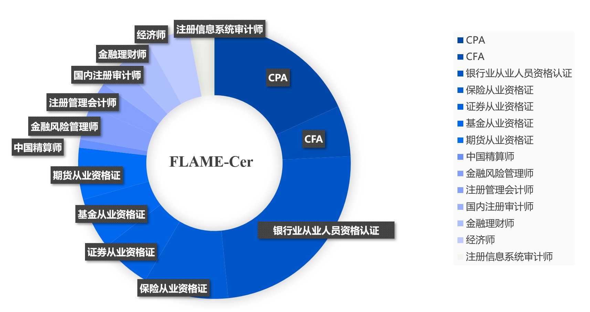
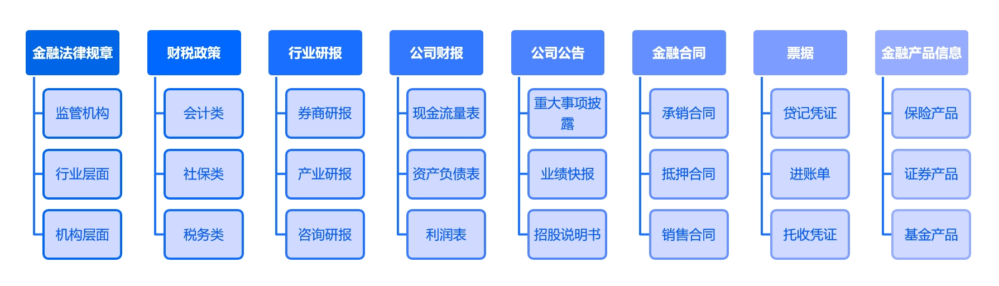
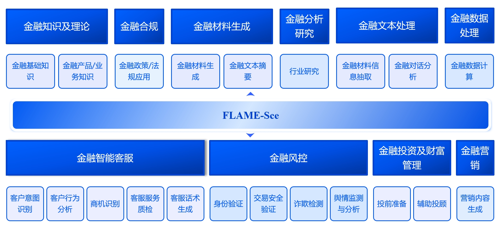

# 1. 评测集介绍 
## 1.1 评测集概述
  **FLAME**（**F**inancial **L**arge-Language Model **A**ssessment and **M**etrics **E**valuation）是由中国人民大学财政金融学院设计的面向金融领域大模型评测体系，旨在全面评估大模型在金融领域的专业能力和实践表现。

  FLAME评测体系包含两大核心评测集：
  - **FLAME-Cer**（*Financial Certification*）：覆盖CPA、CFA、FRM等14类权威金融资格认证，总计约16000道精选题目，所有题目经过人工审核，确保准确性和代表性；
  - **FLAME-Sce**（*Financial Scenario*）：包含10个一级核心金融业务场景，21个二级细分金融业务场景，近百个三级金融应用任务的评测集合。

## 1.2 评测集特点
  - **专业性**：由中国人民大学财政金融学院构建，融合学术理论与实践经验，确保评测内容的专业性和权威性；
  - **全面性**：包含两大核心维度 - 知识维度（*FLAME-Cer*)和应用维度（*FLAME-Sce*)，对模型从专业知识到实践应用进行全方位考核。
  - **应用性**：紧密贴合金融行业真实的业务需求，重点覆盖银行、保险行业的核心应用场景，包括产品销售、风险管理、客户服务等关键环节；
  - **安全性**：严格遵循监管合规要求，从数据安全、业务合规、风险控制等维度进行全方位评估，确保模型应用符合金融行业监管标准。
   
    评测内容会根据金融市场发展和监管要求持续更新，以确保评测体系的时效性和实用性。通过FLAME评测体系，我们旨在为金融领域增强大模型的发展提供专业、全面且实用的评估标准。

# 2. FLAME-Cer: 金融资格认证评测集 
## 2.1 评测集说明
FLAME-Cer是一个全面覆盖金融领域核心资格认证的评测集合，总计包含约16000道精选题目。评测集融合了国内核心从业资格认证与国际权威认证，确保对金融专业知识的全方位评估。
  
  ### 评测集特点
  - **规模领先**：总计约1.6万道精选题目，涵盖金融领域主要资格考试；
  - **分级科学**：根据金融资格认证的市场认可度、行业影响力和专业深度进行分级，区分不同证书的重要程度；
  - **全面覆盖**：确保对每个证书的核心知识点进行充分测试；
  - **严格筛选**：所有题目经过精心审核，确保准确性和代表性。

## 2.2 证书类型及题目分布 

  

  ### 认证重要等级说明：
  - **三星级**：行业核心认证，具有较高的市场认可度和专业要求；
  - **二星级**：重要专业认证，在特定领域具有较强的实务指导意义；
  - **一星级**：辅助性认证，作为金融从业人员的专业技能补充。

<table border="1" cellspacing="0" cellpadding="5">
    <thead>
        <tr>
            <th>序号</th>
            <th>金融执业证书</th>
            <th>简介</th>
            <th>考试科目</th>
            <th>重要等级</th>
            <th>题目比例</th>
        </tr>
    </thead>
    <tbody>
        <tr>
            <td rowspan="6">1</td>
            <td rowspan="6">CPA（注册会计师）</td>
            <td rowspan="6">中国注册会计师执业资格考试，专业阶段包括会计、审计、财务成本管理、经济法、税法和公司战略与风险管理六门科目。</td>
            <td>CPA_会计</td>
            <td rowspan="6">三星</td>
            <td rowspan="6">18%</td>
        </tr>
        <tr><td>CPA_审计</td></tr>
        <tr><td>CPA_公司战略与风险管理</td></tr>
        <tr><td>CPA_税法</td></tr>
        <tr><td>CPA_财务成本管理</td></tr>
        <tr><td>CPA_经济法</td></tr>
        <tr>
            <td rowspan="3">2</td>
            <td rowspan="3">CFA（特许金融分析师）</td>
            <td rowspan="3">涵盖广泛的金融投资知识，包括伦理和专业标准、定量方法、经济学、财务报表分析、公司金融、投资组合管理等。</td>
            <td>CFA一级</td>
            <td rowspan="3">三星</td>
            <td rowspan="3">6%</td>
        </tr>
        <tr><td>CFA二级</td></tr>
        <tr><td>CFA三级</td></tr>
        <tr>
            <td rowspan="12">3</td>
            <td rowspan="12">银行业从业人员资格认证（CCBP）</td>
            <td rowspan="12">中国银行业从业人员资格认证，设有银行业法律法规与综合能力和银行业专业实务两个科目。</td>
            <td>初级《银行业法律法规与综合能力》</td>
            <td rowspan="12">三星</td>
            <td rowspan="12">24%</td>
        </tr>
        <tr><td>初级《个人理财》</td></tr>
        <tr><td>初级《公司信贷》</td></tr>
        <tr><td>初级《个人贷款》</td></tr>
        <tr><td>初级《风险管理》</td></tr>
        <tr><td>初级《银行管理》</td></tr>
        <tr><td>中级《银行业法律法规与综合能力》</td></tr>
        <tr><td>中级《个人理财》</td></tr>
        <tr><td>中级《公司信贷》</td></tr>
        <tr><td>中级《个人贷款》</td></tr>
        <tr><td>中级《风险管理》</td></tr>
        <tr><td>中级《银行管理》</td></tr>
        <tr>
            <td rowspan="10">4</td>
            <td rowspan="10">保险从业资格证</td>
            <td rowspan="10">中国保险从业人员的专业资格考试，内容涉及保险基础知识、风险管理、保险产品、法律法规等多个方面。</td>
            <td>风险管理与人身保险</td>
            <td rowspan="10">三星</td>
            <td rowspan="10">10%</td>
        </tr>
        <tr><td>保险从业人员职业道德</td></tr>
        <tr><td>人身保险产品</td></tr>
        <tr><td>人身保险合同</td></tr>
        <tr><td>保险公司经营与管理</td></tr>
        <tr><td>人身保险市场与营销</td></tr>
        <tr><td>人身保险会计与财务</td></tr>
        <tr><td>寿险公司资产管理</td></tr>
        <tr><td>寿险公司人力资源管理</td></tr>
        <tr><td>人身保险监管</td></tr>
        <tr>
            <td>5</td>
            <td>证券从业资格证</td>
            <td>中国证券行业的准入证书，考试内容包括金融市场基础知识、证券市场基本法律法规等。</td>
            <td>金融市场基本知识 证券市场基本法律法规</td>
            <td>三星</td>
            <td>6%</td>
        </tr>
        <tr>
            <td rowspan="3">6</td>
            <td rowspan="3">基金从业资格证</td>
            <td rowspan="3">中国基金从业人员专业能力考试，内容包括基金法律法规、职业道德与业务规范，以及证券投资基金基础知识或私募股权投资基金基础知识。</td>
            <td>证券投资基金基础知识</td>
            <td rowspan="3">三星</td>
            <td rowspan="3">6%</td>
        </tr>
        <tr><td>基金法律法规、职业道德和业务规范</td></tr>
        <tr><td>私募股权投资基金基础知识</td></tr>
        <tr>
            <td rowspan="3">7</td>
            <td rowspan="3">期货从业资格证</td>
            <td rowspan="3">中国期货从业准入性质考试，内容包括“期货基础知识”、“期货法律法规”和“期货投资分析”。</td>
            <td>期货基础知识</td>
            <td rowspan="3">三星</td>
            <td rowspan="3">6%</td>
        </tr>
        <tr><td>期货法律法规</td></tr>
        <tr><td>期货投资分析</td></tr>
        <tr>
            <td>8</td>
            <td>中国精算师（CAA）</td>
            <td>中国精算师职业资格考试，分为准精算师和正精算师两个级别，涉及精算理论、实务和相关法律法规等多个领域。</td>
            <td>精算师金融数学</td>
            <td>二星</td>
            <td>1%</td>
        </tr>
        <tr>
            <td rowspan="2">9</td>
            <td rowspan="2">金融风险管理师（FRM）</td>
            <td rowspan="2">金融风险管理领域权威国际资格认证，侧重考核财务风险评估工具的相关知识和财务风险评估工具的应用。</td>
            <td>FRM一级</td>
            <td rowspan="2">二星</td>
            <td rowspan="2">4%</td>
        </tr>
        <tr><td>FRM二级</td></tr>
        <tr>
            <td>10</td>
            <td>注册管理会计师（CMA）</td>
            <td>全球管理会计领域的权威认证，内容涵盖财务规划、绩效与分析、战略财务管理等多个方面。</td>
            <td>注册管理会计师</td>
            <td>二星</td>
            <td>3%</td>
        </tr>
        <tr>
            <td rowspan="3">11</td>
            <td rowspan="3">国际注册内部审计师（CIA）</td>
            <td rowspan="3">国际内部审计界唯一公认的职业资格考试，内容涵盖内部审计基础、内部审计实务和内部审计知识要素三个方面。</td>
            <td>CIA_内部审计基础</td>
            <td rowspan="3">二星</td>
            <td rowspan="3">3%</td>
        </tr>
        <tr><td>CIA_内部审计实务</td></tr>
        <tr><td>CIA_内部审计知识要素</td></tr>
        <tr>
            <td rowspan="2">12</td>
            <td rowspan="2">金融理财师（AFP）</td>
            <td rowspan="2">中国金融理财的专业认证，涵盖了限于金融理财基础、家庭综合理财、投资规划、风险管理与保险规划、员工福利与退休规划、个人所得税及其优化等。</td>
            <td>AFP_金融理财基础</td>
            <td rowspan="2">二星</td>
            <td rowspan="2">4%</td>
        </tr>
        <tr><td>AFP_金融理财原理</td></tr>
        <tr>
            <td rowspan="5">13</td>
            <td rowspan="5">经济师</td>
            <td rowspan="5">经济专业技术资格考试，主要考察经济专业知识和实务能力。</td>
            <td>初级经济师_基础知识</td>
            <td rowspan="5">二星</td>
            <td rowspan="5">5%</td>
        </tr>
        <tr><td>中级经济师_基础知识</td></tr>
        <tr><td>中级经济师_（初级）金融专业</td></tr>
        <tr><td>中级经济师_（中级）金融专业</td></tr>
        <tr><td>中级经济师_（高级）金融专业</td></tr>
        <tr>
            <td>14</td>
            <td>注册信息系统审计师（CISA）</td>
            <td>全球公认的信息系统审计师考试，涵盖信息系统审计流程、IT治理和管理、信息系统购置开发与实施、信息系统的运营和业务恢复能力以及信息资产的保护。</td>
            <td>CISA国际注册信息系统审计师</td>
            <td>一星</td>
            <td>3%</td>
        </tr>
    </tbody>
</table>

## 2.3 评分方式说明
在FLAME-Cer金融资格认证评测中，采用准确率作为评价指标，即通过计算模型在考题中的答对率来衡量其表现：模型每答对一道题得1分，答错不得分，最终得分为答对题目数量占总题目数量的百分比。

通过这套全面的评测体系，FLAME-Cer能够有效评估大模型在金融专业知识方面的掌握程度，为金融机构选择和应用大模型提供可靠的参考依据。

# 3. FLAME-Sce: 金融场景应用评测集 
## 3.1 评测集说明
FLAME-Sce是一个专业的金融场景评测集，通过系统化的分级架构和严格的评估标准，全面评估大模型在金融领域的实际应用能力。

  ### 系统化的场景评测体系
  - 三级场景评测架构：10个一级核心业务场景、21个二级细分业务场景和近百个三级应用任务；
  - 精选评测案例库：基于5000+高质量评测案例，覆盖从基础金融知识到复杂业务分析的完整评测链条；
  - 多样化题型设计：评测案例类型丰富，包括名词解释、计算题、简答题、材料分析题及综合论证题；
  ### 金融专业性实践性保障
  - 评测场景源自银行、保险、证券等金融机构的实际业务需求；
  - 评测内容融合金融法规、财税政策、行业研报、合同、票据等专业资料；
  - 定期更新评测内容以响应市场变化和新兴业务需求；
  ### 精细化的评估方案
  - 评估维度涵盖准确性、专业性、合规性等多个关键指标；
  - 根据场景特性设置专属的评估维度组合及权重配置；
  - 将监管合规要求作为评估重点，确保模型输出符合行业标准。

 

## 3.2 评测场景分布
FLAME-Sce构建了系统化的三级场景架构，包含10个核心金融业务领域的一级场景、21个细分的二级金融业务场景以及近百个具体金融任务的三级场景，出于评测公平性考虑，仅公开一、二级场景类目，不对外发布具体评测案例。

场景具体介绍如下

<table>
  <thead>
    <tr>
      <th>序号</th>
      <th>一级场景</th>
      <th>二级场景</th>
      <th>场景介绍</th>
    </tr>
  </thead>
  <tbody>
    <tr>
      <td rowspan="2">1</td>
      <td rowspan="2">金融知识及理论</td>
      <td>金融基础知识</td>
      <td>认识金融领域的专有名词、基础理论、历史事件等知识。</td>
    </tr>
    <tr>
      <td>金融产品/业务知识</td>
      <td>理解并应用银行、保险和证券行业中相关产品说明、机构业务流程等知识。</td>
    </tr>
    <tr>
      <td>2</td>
      <td>金融合规</td>
      <td>金融政策/法规知识</td>
      <td>理解并应用各级金融监管机构颁布的金融政策、法律法规。</td>
    </tr>
    <tr>
      <td rowspan="2">3</td>
      <td rowspan="2">金融材料生成</td>
      <td>金融材料生成</td>
      <td>基于各类需求生成金融行业常见文档，包括但不限各类金融合同、尽调报告、研究报告。</td>
    </tr>
    <tr>
      <td>金融文本摘要</td>
      <td>提取金融文本中的关键信息和核心内容，并以简洁、准确的方式呈现。</td>
    </tr>
    <tr>
      <td rowspan="5">4</td>
      <td rowspan="5">金融智能客服</td>
      <td>客户意图识别</td>
      <td>分析金融场景下客服沟通记录中客户的语言、行为及交易等信息，理解并总结客户的意图。</td>
    </tr>
    <tr>
      <td>客户行为分析</td>
      <td>分析金融场景下客服与客户的沟通记录，判断客户行为倾向。</td>
    </tr>
    <tr>
      <td>商机识别</td>
      <td>分析金融场景下客服与客户的沟通记录，识别并评估其中的潜在商机。</td>
    </tr>
    <tr>
      <td>客服服务质检</td>
      <td>根据金融场景下客服与客户的沟通记录，综合评价客服人员的服务质量，包括语言表达能力、问题解决能力、服务态度及专业度等。</td>
    </tr>
    <tr>
      <td>客服话术生成</td>
      <td>针对银行、保险和证券行业，生成适用于不同客户不同咨询场景的客服回复话术。</td>
    </tr>
    <tr>
      <td rowspan="4">5</td>
      <td rowspan="4">金融风控</td>
      <td>身份验证</td>
      <td>验证金融行业中不同交易情景下客户身份的真实性与合法性。</td>
    </tr>
    <tr>
      <td>交易安全判断</td>
      <td>验证金融行业中不同交易情景下客户交易的安全性。</td>
    </tr>
    <tr>
      <td>欺诈检测</td>
      <td>识别金融行业中不同交易情景下潜在的风险或欺诈行为。</td>
    </tr>
    <tr>
      <td>舆情监测与分析</td>
      <td>收集金融舆情事件中的公众意见、态度和情绪进行，评估其对金融产品、服务或市场趋势的潜在影响。</td>
    </tr>
    <tr>
      <td rowspan="2">6</td>
      <td rowspan="2">金融文本处理</td>
      <td>金融材料信息抽取</td>
      <td>从各类金融材料中自动识别、提取关键信息，并进行结构化输出。</td>
    </tr>
    <tr>
      <td>金融对话分析</td>
      <td>通过分析直接或间接的对话记录中客户的行为倾向，探究客户的需求与偏好。</td>
    </tr>
    <tr>
      <td>7</td>
      <td>金融分析研究</td>
      <td>行业研究</td>
      <td>对金融行业发布的各类研究报告进行分析解读，包括但不限于识别报告中的关键数据、趋势分析、市场预测及政策影响等。</td>
    </tr>
    <tr>
      <td rowspan="2">8</td>
      <td rowspan="2">金融投资与财富管理</td>
      <td>投前准备</td>
      <td>根据客户的基本信息和交易行为分析客户的风险承受能力和投资偏好，构建客户画像。</td>
    </tr>
    <tr>
      <td>辅助投顾</td>
      <td>基于现代投资组合理论，根据投资者的风险偏好和收益目标，提供个性化资产配置建议。</td>
    </tr>
    <tr>
      <td>9</td>
      <td>金融营销</td>
      <td>营销内容生成</td>
      <td>个性化生成向金融行业中不同客户推销不同金融产品的营销话术。</td>
    </tr>
    <tr>
      <td>10</td>
      <td>金融数据处理</td>
      <td>金融数据计算</td>
      <td>对财务数据进行分析和处理，计算出各种关键财务比率和指标。</td>
    </tr>
  </tbody>
</table>

## 3.3 评测说明
FLAME-Sce采用多维度评估体系，根据不同场景特点设置差异化的评估维度和权重。

### 3.3.1 基础评估维度
FLAME-Sce评估体系设计了一套全面的基础评估维度，用于衡量大模型在实际金融场景中的表现。这些维度是通过分析金融行业不同应用场景的共性需求提炼而成的，执行评测时根据不同场景的特点进行灵活调整和权重配置。

| **评价维度** | **评价维度说明** |
|:--------------:|:----------------:|
| **准确性**   | - **信息准确度**：评估金融概念、专业术语、数据和事实陈述的准确性及其与实际情况的符合程度。  - **分析准确度**：评估推理过程的严谨性和导出结论的依据充分性。 |
| **完整性**   | - **内容覆盖**：评估回答是否完整涵盖了问题的所有关键点，包括必要的背景信息、核心要素、示例等。  - **深度广度**：评估分析的深度以及对相关知识点的延展性。 |
| **合规性**   | - **监管合规**：评估对金融法律法规、监管要求和行业标准的遵循程度。  - **风险控制**：评估是否有充分的风险提示、是否识别了潜在风险点、是否给出了风险应对建议等。 |
| **相关性**   | - **答案匹配度**：评估回答内容是否紧扣问题核心，不偏离主题。  - **意图适配度**：评估提供的信息和建议是否满足用户实际提问意图。 |
| **专业性**   | - **金融专业知识**：评估金融理论运用、行业规则理解和专业分析能力的表现。  - **行业洞察力**：评估对市场状况、行业趋势的把握以及提供综合分析和专业建议的能力。 |
| **清晰性**   | - **表达清晰**：评估语言表达的清晰性、结构的层次性和逻辑的连贯性。  - **易理解性**：评估专业内容的通俗化表达，是否提供了必要的解释说明以方便理解等。 |
| **实用性**   | - **实践指导性**：评估模型输出方案的可执行性和实践参考价值。  - **业务契合度**：评估模型输出的解决方案与金融业务实践的匹配程度。 |
| **指标遵循度** | 评估模型对指令要求的完整执行程度，包括输出格式、风格、内容范围等具体限制条件的满足情况。 |

### 3.3.2 场景特定的评估维度及权重配置
FLAME-Sce针对近百个细分的三级具体金融应用任务分别制定了专属的评估维度组合及权重配置方案，确保评测标准与场景特点高度匹配。以下是具体的示例

<table>
  <tr>
    <th>一级场景</th>
    <th>二级场景</th>
    <th>三级场景</th>
    <th>评价维度</th>
    <th>评价维度权重配置</th>
  </tr>
  <tr>
    <td rowspan="5">金融材料生成</td>
    <td rowspan="5">金融文本摘要</td>
    <td rowspan="5">金融会议纪要要摘要</td>
    <td>1. <b>准确性</b>：摘要是否涵盖了会议中的所有关键信息和决策，是否与会议内容完全一致，没有误解或错误引述。</td>
    <td>准确性：30%</td>
  </tr>
  <tr>
    <td>2. <b>完整性</b>：摘要是否完整地反映了会议的主要议题、讨论内容和结果，摘要是否适当保留了会议中的重要细节，以便读者能够理解讨论的背景和依据。</td>
    <td>完整性：30%</td>
  </tr>
  <tr>
    <td>3. <b>清晰性</b>：摘要是否使用了简单明了的语言，避免了不必要的复杂词汇和术语；摘要中的各个部分是否有清晰的划分，便于读者快速定位感兴趣的内容。</td>
    <td>清晰性：10%</td>
  </tr>
  <tr>
    <td>4. <b>实用性</b>：摘要是否明确了会议后的行动计划、责任人和截止日期，以便于执行和跟踪；摘要是否提供了足够的信息，以支持管理层做出后续的决策。</td>
    <td>实用性：10%</td>
  </tr>
  <tr>
    <td>5. <b>指令遵循</b>：是否完整遵循指令要求，如果对输出有限制（比如限制输出格式），需要严格遵循。</td>
    <td>指令遵循：20%</td>
  </tr>
  <tr>
    <td rowspan="4">金融投资与财富管理</td>
    <td rowspan="4">投前准备</td>
    <td rowspan="4">客户画像分析</td>
    <td>1. <b>准确性</b>：所有提取的客户信息是否与原始数据完全一致，无任何错误；分析结论是否完全基于事实依据，推理严谨，判断准确。</td>
    <td>准确性：30%</td>
  </tr>
  <tr>
    <td>2. <b>完整性</b>：分析是否涵盖客户基础特征、行为特征、需求特征等所有关键维度，分析结论是否提供了有价值洞察。</td>
    <td>完整性：30%</td>
  </tr>
  <tr>
    <td>3. <b>逻辑性</b>：分析过程是否框架清晰，层次分明，各部分衔接自然；论证过程是否严密，各结论之间是否逻辑关系清晰，无矛盾。</td>
    <td>逻辑性：20%</td>
  </tr>
  <tr>
    <td>4. <b>指令遵循</b>：是否完全遵循指令要求，如果对输出有限制（比如限制输出格式），需要严格遵循。</td>
    <td>指令遵循：20%</td>
  </tr>
  <tr>
    <td rowspan="4">金融合规</td>
    <td rowspan="4">金融政策/法规应用</td>
    <td rowspan="4">财税政策问答</td>
    <td>1. <b>准确性</b>：回复中的信息是否和财税政策文件中的内容一致，是否存在有误导性的陈述；如果回复中包含统计数据或具体数字，这些数据是否准确无误。</td>
    <td>准确性：40%</td>
  </tr>
  <tr>
    <td>2. <b>相关性</b>：答案是否完全聚焦于用户咨询的具体财税政策，涵盖用户提问的所有关键点，没有偏离主题的内容；提供的解答完全符合用户的应用场景。</td>
    <td>相关性：20%</td>
  </tr>
  <tr>
    <td>3. <b>完整性</b>：回复是否全面覆盖了问题所涉及的规章制度内容，没有遗漏重要的信息点。对于需要详细解释的部分，回复是否提供了足够的细节和背景信息。</td>
    <td>完整性：20%</td>
  </tr>
  <tr>
    <td>4. <b>指令遵循</b>：是否完整遵循指令要求，如果对输出有限制（比如限制输出格式），需要严格遵循。</td>
    <td>指令遵循：20%</td>
  </tr>
</table>

### 3.3.3 评分方式说明
FLAME-Sce采用两步式评分机制，通过分维度打分和权重计算相结合的方式，对模型在各场景下的表现进行量化评估：

#### 第一步：维度评分
- 评分范围：-1分至5分
- 满分标准：5分代表在该维度下的最优表现
- 负分说明：-1分用于标记严重违反该维度基本要求的情况（如合规性违规）

#### 第二步：加权计算
- 根据场景特定的维度权重配置计算加权得分
- 计算公式：最终得分 = Σ(维度得分 × 维度权重)

#### 可用性判定 
- 基础场景（如金融名词解释）：得分≥3分判定为可用
- 高要求场景（如风控类）：得分≥4分判定为可用
- 任一维度得分为-1分时，整体判定为不可用
通过这种评分方式，确保模型在每个具体场景下都能得到准确、合理的评估结果。

# 4. 基准效果 
  在FLAME评测基准上，我们精选了国内外代表性的大语言模型进行综合评估，包括开源生态中广受认可的Qwen2.5-72B、业界领先的大模型GPT-4o、金融领域的开源模型XuanYuan3-70B、国内知名的通用闭源模型ERNIE-4.0-Turbo和GLM-4-PLUS，以及专门面向金融领域强化的Baichuan4-Finance。

## 4.1 FLAME-Cer 评测结果
  从整体排名看，Baichuan4-Finance以93.62%的准确率领先，其次是Qwen2.5-72B（88.24%），而GPT-4o、GLM-4-PLUS和ERNIE-4.0-Turbo表现相近（约77%-81% ），XuanYuan3还有提升空间（72%）。
  
  从各考试科目具体表现看，在基金、证券、银行从业资格证考试中，各模型普遍表现较好，大多数模型在这些考试中的准确率都超过80%；CAA(中国精算师)考试对所有模型来说都较具挑战性，准确率普遍较低，即使表现最好的Baichuan4-Finance准确率也仅为66.51%；Baichuan4-Finance在多个考试科目中的准确率超过95%，尤其在基金从业资格和证券从业资格考试中表现格外突出，准确率分别达到97.93%和97.60%。

| **金融执业证书**            | **GPT-4o (API)** | **Qwen2.5-72B-Instruct (开源)** | **XuanYuan3-70B-Chat (金融开源)** | **ERNIE-4.0-Turbo-128K (API)** | **GLM-4-PLUS (API)** | **Baichuan4-Finance** |
|:---------------------------:|:----------------:|:-----------------------------:|:------------------------------:|:----------------------------:|:--------------------:|:---------------------:|
| 注册会计师 (CPA)            |      68.67       |            85.31              |             68.64             |            70.18            |        78.95         |       **93.16**       |
| 特许金融分析师 (CFA)        |    **86.97**     |            82.92              |             63.88             |            74.44            |        81.45         |         85.59         |
| 银行业从业人员资格认证 (CCBP) |      78.70       |            92.72              |             79.26             |          **86.97**          |        86.47         |       **96.42**       |
| 保险从业资格证              |      81.20       |            86.61              |             69.10             |            79.95            |        81.70         |       **93.82**       |
| 证券从业资格证              |      76.69       |            94.33              |             78.74             |            84.21            |        88.72         |       **97.60**       |
| 基金从业资格证              |      82.96       |            94.61              |             76.73             |            84.21            |        84.71         |       **97.93**       |
| 期货从业资格证              |      75.94       |            90.23              |             73.74             |            78.45            |        82.46         |       **96.54**       |
| 中国精算师 (CAA)            |      44.65       |            55.81              |             31.63             |            48.37            |        43.26         |       **66.51**       |
| 金融风险管理师 (FRM)        |      74.94       |            76.87              |             55.46             |            67.92            |        76.69         |       **82.87**       |
| 注册管理会计师 (CMA)        |      83.21       |          **86.1**             |             65.71             |            73.68            |        76.69         |       **86.1**        |
| 国际注册内部审计师 (CIA)    |      84.46       |            86.69              |             70.53             |            77.94            |        83.46         |       **92.59**       |
| 金融理财师 (AFP)            |      74.19       |            79.37              |             64.09             |            72.93            |        79.95         |       **90.08**       |
| 经济师                     |      80.45       |            93.41              |             82.35             |            87.97            |        90.48         |       **95.78**       |
| 注册信息系统审计师 (CISA)    |      86.72       |            86.83              |             70.31             |            77.94            |        83.96         |       **95.76**       |
| 汇总 (ACC)    |      78.23       |            88.24              |             72.07             |            77.03            |        81.17         |       **93.62**       |

## 4.2 FLAME-Sce 评测结果
  从整体排名看，Baichuan4-Finance以84.15%的可用率位居首位，GPT-4o和Qwen2.5-72B表现接近（约79%），ERNIE-4.0-Turbo和GLM-4-PLUS的表现也达到了不错的水平（约76%~78%），而XuanYuan3（61.34%）在金融场景应用方面还有一定提升空间。
  
  从分场景具体表现看，多数模型在金融知识理论、金融数据计算类场景表现较好，可用性普遍超过80%；但在金融分析研究、金融文档生成类场景普遍得分较低，显示这是当前各模型普遍需要提升的方向。Baichuan4-Finance在大多数场景中都保持稳定的高水平表现，在金融智能客服和金融风控方面表现突出（85-87%），Qwen2.5-72B在数据计算场景中达到91.61%的高分，ERNIE-4.0-Turbo在金融营销类场景表现突出（93.94%），GLM-4-PLUS则在金融合规（86.95%）、金融投资与财富管理（89.29%）领域展现了实力。

| **一级金融应用场景**       | **GPT-4o (API)** | **ERNIE-4.0-Turbo-128K (API)** | **GLM-4-PLUS (API)** | **Qwen2.5-72B-Instruct (开源)** | **XuanYuan3-70B-Chat (开源)** | **Baichuan4-Finance** |
|:-------------------------:|:----------------:|:-----------------------------:|:--------------------:|:-----------------------------:|:---------------------------:|:--------------------:|
| 金融知识及理论             |      89.14       |            87.67              |        87.06         |            87.75             |           76.94            |       **91.17**       |
| 金融合规                   |      80.27       |            80.27              |        **86.95**     |            83.61             |           40.13            |       **87.24**       |
| 金融文档生成               |      60.01       |            58.89              |        61.11         |            58.89             |           41.11            |       **70.03**       |
| 金融智能客服               |      83.52       |            79.59              |        79.78         |            83.18             |           62.37            |       **86.92**       |
| 金融风控                   |      82.94       |            75.86              |        80.3          |            81.99             |           63.93            |       **85.36**       |
| 金融文档处理               |      83.51       |            80.22              |        65.88         |            80.18             |           65.91            |       **86.77**       |
| 金融数据计算               |      86.43       |            **89.99**          |        79.87         |            91.61             |           71.92            |       **91.71**       |
| 金融分析及研究             |      45.45       |            **48.48**          |        42.42         |            42.42             |           33.33            |       45.45       |
| 金融营销                   |      57.58       |            **93.94**          |        75.76         |            54.55             |           30.3             |       78.79       |
| 金融投资与财富管理         |      85.71       |            71.43              |       **89.29**      |            85.71             |           67.86            |       **89.29**       |
| 汇总（可用率）         |    79.88    |          78.01           |      76.92       |          79.18          |         61.34          |       **84.15**      |

# 5. 数据
FLAME评测数据开放了金融资格认证的部分样例数据供研究使用，位于data目录下，包含了14个金融资格认证的样例评测数据，每个认证科目提供50道标准测试题。

出于确保评测体系有效性和金融数据安全考虑，FLAME-Sce评测集仅对外公开一、二级场景类目的框架说明。由于金融场景评测案例中包含大量真实业务场景和敏感信息，因此具体评测案例暂不对外发布。

# 6. 如何评测  
如您需要对您的模型进行评测，请发送邮件至 [xutonghui@ruc.edu.cn](mailto:xutonghui@ruc.edu.cn)，并在邮件中提供以下信息：  

- 申请机构名称  
- 申请评测的模型名称及版本  
- 模型基本信息（如模型参数量、训练数据规模等）  
- 联系人姓名及职务  
- 联系方式（手机号、邮箱）  

# 7. 引用  
如果您使用了我们的数据集，请引用我们的论文《FLAME: Financial Large-Language Model Assessment and Metrics Evaluation》（论文会在2024年12月底发出）。  

# 8. 备注  
**重要声明**：本评测数据集（FLAME）仅供学术研究和评测使用，严禁将其用于任何模型训练目的。
